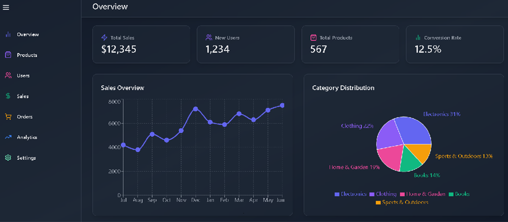

# **Dynamic Dashboard Application**

A web application designed to provide streamlined data management and insightful analytics through dynamic dashboards. This project empowers users with efficient tools for user management and analytics visualization.

# **Image**

## **Live Demo:**

<a href='https:https://dynamic-dashboard-nu.vercel.app/' target='_blank'>View Live</a>

## **Key Features:**

- **User Management Dashboard:**
  Offers comprehensive tools to manage user data, including adding, editing, and removing users.
  
- **Analytics Dashboard:**
  Displays real-time analytics and visualizations for data-driven insights.

- **State Management:**
  Implements Redux for robust and predictable state management.

- **API Integration:**
  Leverages Redux Thunk to integrate and manage API calls efficiently.

- **TypeScript Integration:**
  Enhances code reliability and maintainability with TypeScript.

- **Responsive Design:**
  Ensures a seamless user experience across various devices.

## **Tech Stack:**

- **Frontend:** React, TypeScript
- **State Management:** Redux, Redux Thunk
- **Design:** Responsive UI with CSS
- **API Integration:** Fetching and managing data through APIs

## **Future Enhancements:**

- Add more detailed analytics and custom reports.
- Enhance API error handling.
- Implement role-based access control.

---
Feel free to contribute to this project by submitting issues and pull requests!

